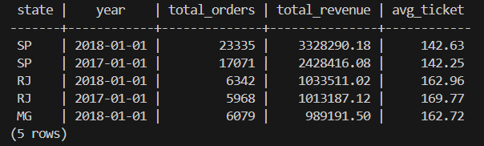
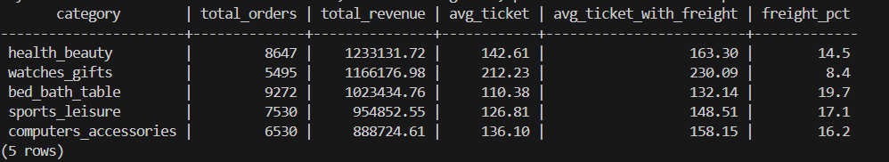

# Brazilian E-commerce ETL Pipeline

End-to-end ETL pipeline using the [Olist Brazilian E-commerce dataset](https://www.kaggle.com/datasets/olistbr/brazilian-ecommerce) from Kaggle.

Raw CSV files are ingested into PostgreSQL, transformed with dbt, and orchestrated daily by Apache Airflow — all running locally with a single `docker compose up`.

---

## Architecture

```
┌─────────────────────────────────────────────────────────────────┐
│                        Docker Compose                           │
│                                                                 │
│  ┌──────────────┐    ┌──────────────────────────────────────┐  │
│  │   data/      │    │           PostgreSQL 15               │  │
│  │  (CSVs)      │    │                                      │  │
│  │              │    │  ┌──────────┐ ┌─────────┐ ┌───────┐ │  │
│  └──────┬───────┘    │  │   raw    │ │ staging │ │ marts │ │  │
│         │            │  └────▲─────┘ └────▲────┘ └───▲───┘ │  │
│         │            │       │             │           │     │  │
│  ┌──────▼───────┐    │       │        ┌────┴───────────┘     │  │
│  │  ingestion/  ├────┼───────┘        │   dbt models        │  │
│  │  ingest.py   │    │                │   staging/ (views)  │  │
│  └──────────────┘    │                │   marts/  (tables)  │  │
│                      └────────────────┴─────────────────────┘  │
│                                                                 │
│  ┌──────────────────────────────────────────────────────────┐  │
│  │              Apache Airflow 2.9  (LocalExecutor)         │  │
│  │                                                          │  │
│  │  check_files → ingest_raw → dbt_deps → dbt_staging       │  │
│  │                          → dbt_marts → dbt_test          │  │
│  └──────────────────────────────────────────────────────────┘  │
└─────────────────────────────────────────────────────────────────┘
```

---

## Stack

| Layer | Tool |
|---|---|
| Ingestion | Python + pandas + SQLAlchemy |
| Storage | PostgreSQL 15 |
| Transformation | dbt-postgres 1.7 |
| Orchestration | Apache Airflow 2.9 |
| Infrastructure | Docker Compose |

---

## How Each Tool Works in This Project

### Docker & Docker Compose

Docker packages an application together with all its dependencies into a **container** — an isolated environment that runs identically on any machine, regardless of the host operating system.

The `docker-compose.yml` defines and starts all project services with a single command:

| Service | Role |
|---|---|
| `postgres` | PostgreSQL database hosting the `raw`, `staging` and `marts` schemas |
| `airflow-init` | One-shot container: initializes the Airflow database and creates the admin user |
| `airflow-webserver` | Serves the Airflow UI at `http://localhost:8080` |
| `airflow-scheduler` | Monitors DAGs and triggers task execution on schedule |

All Airflow services share the same custom image (defined in `Dockerfile`), which extends the official Airflow image and adds `dbt-postgres`, `pandas` and `psycopg2`.

Data is shared between containers via **volumes** — for example, the local `./dbt` folder is mounted as `/opt/dbt` inside the Airflow containers, allowing the scheduler to run dbt models without copying files into the image.

---

### Apache Airflow

Airflow is a **data pipeline orchestration** platform. Instead of running scripts manually or with loose cron jobs, you define a pipeline as a **DAG** (Directed Acyclic Graph) — a set of tasks with explicit dependencies between them.

In this project, the `olist_etl_pipeline` DAG defines 6 tasks in sequence:

```
check_files → ingest_raw → dbt_deps → dbt_staging → dbt_marts → dbt_test
```

| Task | Operator | What it does |
|---|---|---|
| `check_files` | PythonOperator | Verifies all 9 CSV files are present before any work begins |
| `ingest_raw` | PythonOperator | Loads the CSVs into the `raw` schema in PostgreSQL |
| `dbt_deps` | BashOperator | Installs dbt packages (e.g. `dbt_utils`) |
| `dbt_staging` | BashOperator | Runs the 7 staging models (`dbt run --select staging`) |
| `dbt_marts` | BashOperator | Runs the 3 mart models (`dbt run --select marts`) |
| `dbt_test` | BashOperator | Executes all 32 data quality tests (`dbt test`) |

If any task fails, Airflow halts execution and marks all downstream tasks as blocked — ensuring bad data never advances to the next stage.

The DAG is configured with `schedule_interval="@daily"` and can also be triggered manually from the UI at any time.

---

### dbt (data build tool)

dbt is a **transformation layer that runs inside the database**. Instead of writing Python scripts to transform data and save results, you write **pure SQL** and dbt handles creating views and tables in PostgreSQL in the correct dependency order.

This project follows a two-layer architecture:

#### Staging Layer — `dbt/models/staging/`

Views built directly on top of the `raw` schema. Each model maps to one raw table and has a single responsibility: **clean and standardize** the data.

- Cast text columns to proper types (`::timestamp`, `::numeric`, `::int`)
- Rename columns to consistent snake_case
- Handle nulls and empty strings
- Normalize text fields (e.g. `upper(state)`, `initcap(city)`)

Staging views **do not duplicate data** — they are a read-only transformation layer over `raw`.

```sql
-- Example: stg_orders.sql
select
    order_id,
    customer_id,
    order_status,
    order_purchase_timestamp::timestamp  as purchased_at,
    order_approved_at::timestamp         as approved_at,
    ...
from {{ source('raw', 'orders') }}
where order_id is not null
```

#### Marts Layer — `dbt/models/marts/`

Materialized tables that answer **business questions**. Built on top of staging models — they never access `raw` directly.

| Model | Business question |
|---|---|
| `mart_revenue_by_state` | Which states generate the most revenue? What is the average ticket per state per year? |
| `mart_monthly_orders` | How does order volume trend month over month? How many were delivered vs cancelled? |
| `mart_avg_ticket_by_category` | Which product categories have the highest average ticket? What share of revenue is freight? |

#### Data Quality Tests

dbt runs **32 tests automatically** after every run:

- **Generic tests** (defined in `_schema.yml`): `not_null`, `unique`, `accepted_values`
- **Singular tests** (in `tests/`): custom SQL queries that return zero rows when data is correct

If any test fails, Airflow marks the DAG run as failed — preventing inconsistent data from reaching downstream consumers.

---

## Results

### Revenue by State


São Paulo leads with R$ 3.3M in 2018, followed by Rio de Janeiro and Minas Gerais.

### Top Categories by Average Ticket


`watches_gifts` has the highest average ticket (R$ 212), while `health_beauty` leads in order volume.

---

## Prerequisites

- [Docker Desktop](https://www.docker.com/products/docker-desktop/) (with Compose v2)
- Kaggle account to download the dataset

---

## Quickstart

### 1. Clone the repository

```bash
git clone <repo-url>
cd brazilian-ecommerce-etl
```

### 2. Download the dataset

Download from [Kaggle](https://www.kaggle.com/datasets/olistbr/brazilian-ecommerce), unzip and move all CSV files into the `data/` folder:

```
data/
├── olist_orders_dataset.csv
├── olist_order_items_dataset.csv
├── olist_customers_dataset.csv
├── olist_products_dataset.csv
├── olist_sellers_dataset.csv
├── olist_order_payments_dataset.csv
├── olist_order_reviews_dataset.csv
├── olist_geolocation_dataset.csv
└── product_category_name_translation.csv
```

### 3. Configure environment (Linux only)

```bash
echo "AIRFLOW_UID=$(id -u)" >> .env
```

On Windows and macOS with Docker Desktop this step can be skipped.

### 4. Build and start all services

```bash
docker compose up --build -d
```

This will:
1. Build the custom Airflow image with dbt installed
2. Start PostgreSQL and create the `olist` + `airflow` databases
3. Initialize Airflow (migrate DB, create admin user)
4. Start the Airflow webserver and scheduler

Wait ~2 minutes for initialization to complete. Monitor with:

```bash
docker compose ps        # all services should show "healthy" or "running"
docker compose logs -f airflow-init   # watch initialization progress
```

### 5. Trigger the pipeline

Open **http://localhost:8080** → login with `admin` / `admin`

1. Find the `olist_etl_pipeline` DAG
2. Toggle it **On**
3. Click **▶ Trigger DAG** to run immediately

Watch the tasks turn green one by one in the **Graph** view.

### 6. Query the results

```bash
docker compose exec postgres psql -U olist -d olist
```

```sql
-- Top 10 states by revenue
SELECT * FROM marts.mart_revenue_by_state ORDER BY total_revenue DESC LIMIT 10;

-- Monthly order trend
SELECT * FROM marts.mart_monthly_orders ORDER BY order_month;

-- Top categories by average ticket
SELECT * FROM marts.mart_avg_ticket_by_category ORDER BY avg_ticket DESC LIMIT 10;
```

---

## Project Structure

```
.
├── Dockerfile                  # Airflow 2.9 image + dbt-postgres + pandas
├── docker-compose.yml          # Services: postgres, airflow-init, webserver, scheduler
├── .env.example                # Environment variables template
│
├── data/                       # CSV files go here (gitignored)
├── postgres/
│   └── init_db.sh              # Creates olist + airflow databases on first run
│
├── ingestion/
│   └── ingest.py               # Loads all 9 CSVs into PostgreSQL raw schema
│
├── dbt/
│   ├── dbt_project.yml         # Project config: model paths, materializations per layer
│   ├── profiles.yml            # DB connection — reads credentials from env vars
│   ├── packages.yml            # dbt_utils dependency
│   ├── models/
│   │   ├── staging/            # 7 views: type casting + column renaming
│   │   └── marts/              # 3 tables: business metrics
│   └── tests/
│       └── assert_no_negative_prices.sql
│
└── airflow/
    └── dags/
        └── olist_etl_dag.py    # Pipeline DAG with 6 tasks
```

---

## Useful Commands

```bash
# Follow logs for a specific service
docker compose logs -f airflow-scheduler

# Run dbt manually (outside the DAG)
docker compose exec airflow-scheduler \
  dbt run --profiles-dir /opt/dbt --project-dir /opt/dbt

# Run only the tests
docker compose exec airflow-scheduler \
  dbt test --profiles-dir /opt/dbt --project-dir /opt/dbt

# Run a specific model
docker compose exec airflow-scheduler \
  dbt run --profiles-dir /opt/dbt --project-dir /opt/dbt --select mart_revenue_by_state

# Tear down (keeps PostgreSQL data volume)
docker compose down

# Tear down and wipe all data
docker compose down -v
```
